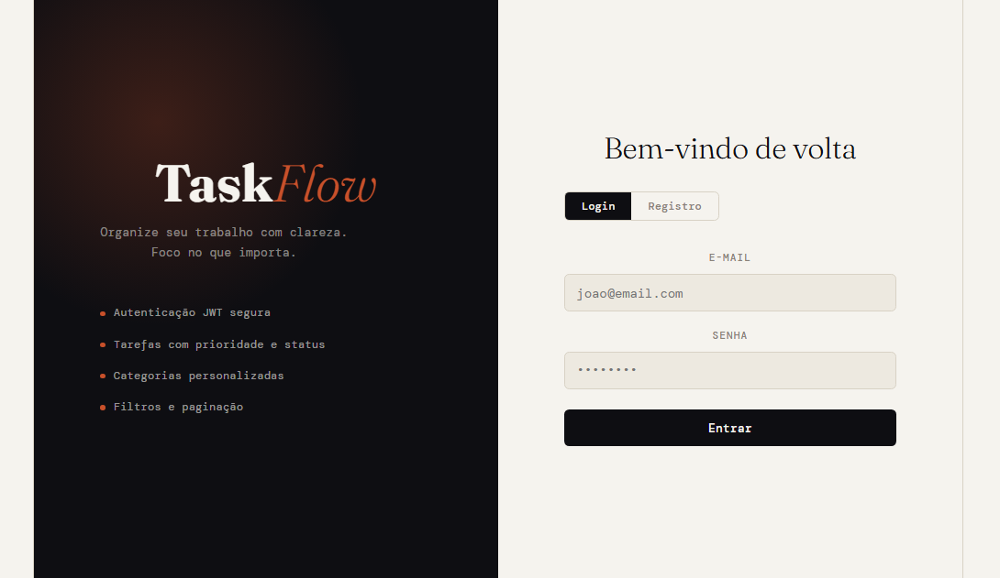
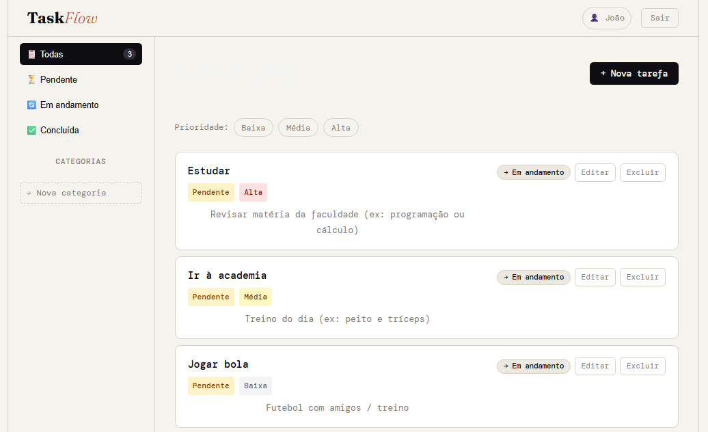
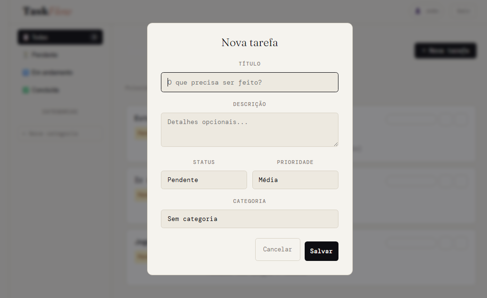

# 🚀 TaskFlow Frontend

Interface web do **TaskFlow**, uma aplicação completa de gerenciamento de tarefas — React · Vite · API REST

---

## ✨ Funcionalidades

🔐 Autenticação de usuário (login e registro)
📋 CRUD completo de tarefas
🗂️ Organização por categorias
🔎 Filtros por status, prioridade e categoria
🌙 Tema claro/escuro
🔔 Feedback visual com toasts
⚡ Interface rápida e responsiva

---

## 🧱 Stack

| Camada      | Tecnologia        |
| ----------- | ----------------- |
| Frontend    | React 18          |
| Build Tool  | Vite              |
| Linguagem   | JavaScript (ES6+) |
| Estilização | CSS               |
| API Client  | Fetch API         |

---

## 🗂️ Estrutura do Projeto

```bash
src/
├── components/
├── hooks/
├── services/
├── styles/
├── App.jsx
└── main.jsx
```

---

## ⚡ Como Rodar

### 1. Clone o repositório

```bash
git clone https://github.com/joaovilela-dev/taskflow-front.git
cd taskflow-front
```

### 2. Instale as dependências

```bash
npm install
```

### 3. Rode o projeto

```bash
npm run dev
```

Aplicação disponível em: http://localhost:5173

---

## 🌐 Integração com API

Este frontend consome a API do TaskFlow:

* Base URL: `https://taskflow-api-z8fz.onrender.com`

Certifique-se de que o backend esteja rodando corretamente.

---

## 🔗 Backend

A API utilizada neste projeto está disponível em:

* Repositório: https://github.com/joaovilela-dev/taskflow-api
* Documentação: https://taskflow-api-z8fz.onrender.com/docs

---

## 📸 Preview

### 🔐 Tela de Login



### 📋 Dashboard



### ✅ Tarefas



---

## 🔐 Autenticação

O sistema utiliza autenticação via JWT.

Após login ou registro, o token é armazenado e enviado automaticamente nas requisições protegidas.

---

## 🚀 Deploy

Frontend disponível em: https://taskflow-front-tau.vercel.app

---

## 📌 Status do Projeto

✅ Finalizado

---

## 📄 Licença

MIT © 2026 João Victor Vilela

---

## 👨‍💻 Autor

João Victor Vilela
